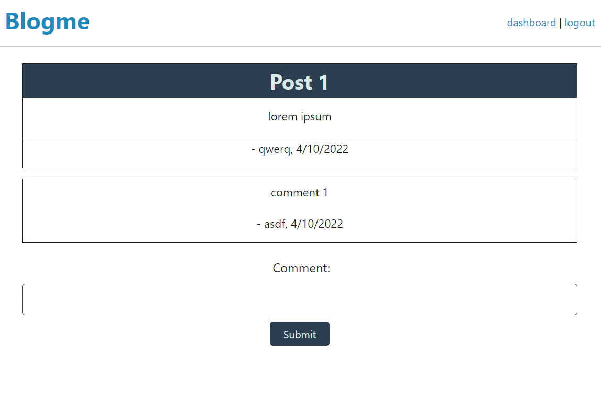

# Blogme
A fullstack application with a functioning login system that accepts user input, and saves posts and comments and user profiles in a MySQL database to be called with an ORM and served through handlebar pages

## Link to Deployed Application

## Dependencies
* [Node.js](https://nodejs.org/en/)
* [MySQL2](https://www.npmjs.com/package/mysql2)
* [Express](https://expressjs.com/)
* [express-handlebars](https://www.npmjs.com/package/express-handlebars)
* [express-session](https://www.npmjs.com/package/express-session)
* [path](https://www.npmjs.com/package/path)
* [dotenv](https://www.npmjs.com/package/dotenv)
* [Sequelize](https://sequelize.org/)
* [connect-session-sequelize](https://www.npmjs.com/package/connect-session-sequelize)
* [bcrypt](https://www.npmjs.com/package/bcrypt)
